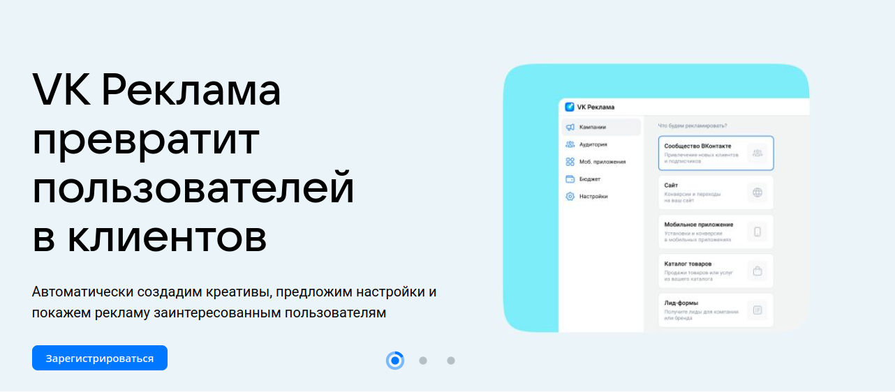
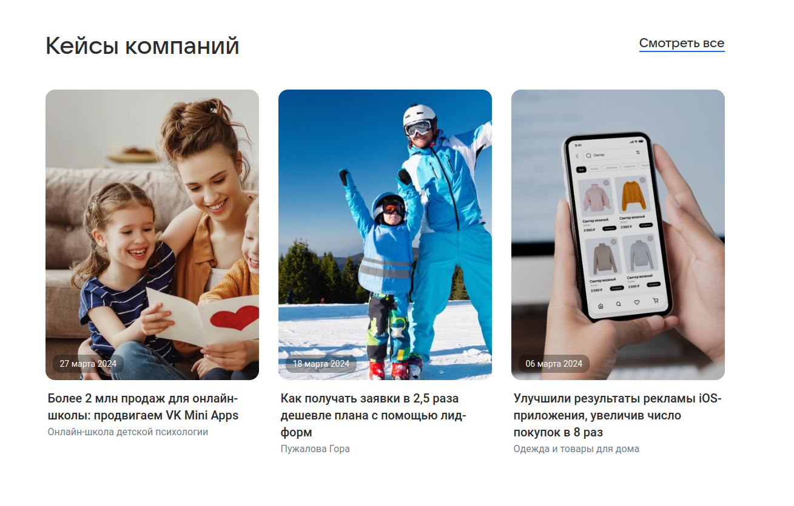
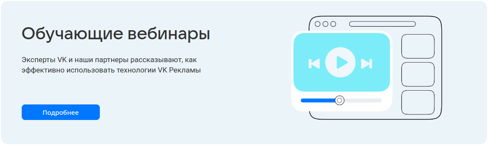
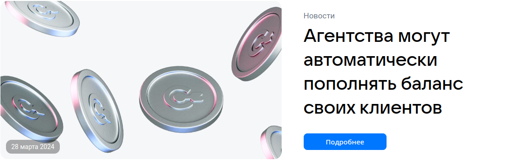
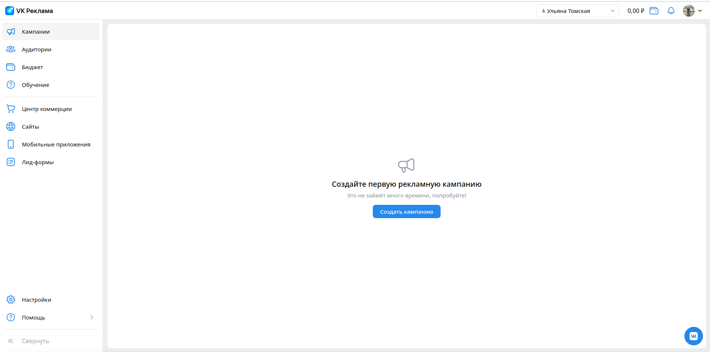
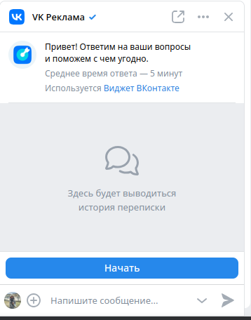
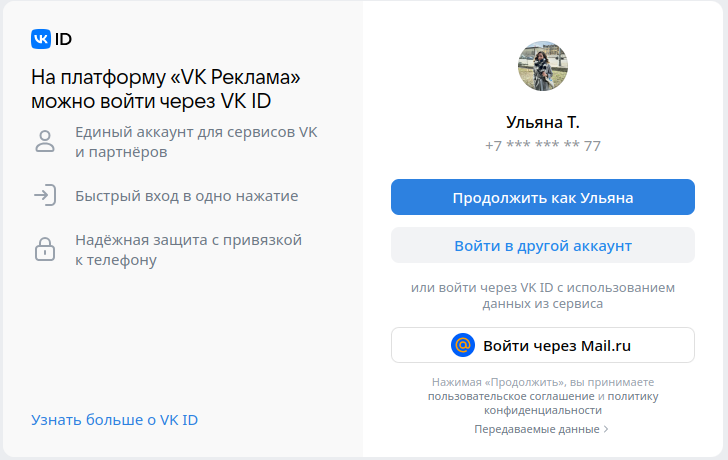
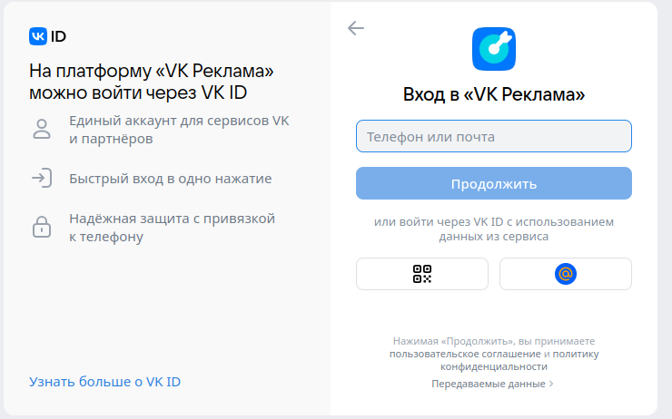

Главная страница - Ульяна
Авторизация и регистрация - Ульяна
Новости - Ульяна
Форум идей - Ульяна
Настройки. Общее - Ульяна
Настройки. История изменений - Ульяна

## Главная страница (для неавторизованных пользователей)

- При нажатии на кнопку "Зарегистрироваться" происходит переход на страницу регистрации

#### Кейсы компаний

- При переходе по ссылке "Смотреть все" происходит переход на страницу кейсов (https://ads.vk.com/cases)
- При нажатии на любой блок кейса происходит переход на страницу данного кейса

#### Обучающие вебинары

- При нажатии на кнопку "Подробнее" происходит переход на страницу мероприятий (https://ads.vk.com/events)
- При нажатии на баннер "Вебинары" происходит переход на страницу мероприятий (https://ads.vk.com/events)

#### Блок новостей

- При нажатии на блок новостей происходит переход на страницу данной новости 

## Кабинет (главная страница для авторизованных пользователей)

- После авторизации происходит переход на страницу кампаний 
- При нажатии на кнопку меню "Компании" происходит переход на страницу компаний
- При нажатии на кнопку меню "Аудитории" происходит переход на страницу аудиторий (https://ads.vk.com/hq/audience) 
- При нажатии на кнопку меню "Бюджет" происходит переход на страницу бюджета (https://ads.vk.com/hq/budget/transactions)
- При нажатии на кнопку меню "Обучение" открывается модальное окно обучения 
- При нажатии на кнопку меню "Обучение" и последующем нажатии на любое место экрана за пределами модального окна обучения окно обучения исчезает
- При нажатии на кнопку меню "Центр коммерции" происходит переход на страницу центра коммерции (https://ads.vk.com/hq/ecomm/catalogs)
- При нажатии на кнопку меню "Сайты" происходит переход на страницу сайтов (https://ads.vk.com/hq/pixels)
- При нажатии на кнопку меню "Мобильные приложения" происходит переход на страницу мобильных приложений (https://ads.vk.com/hq/apps)
- При нажатии на кнопку меню "Лид-формы" происходит переход на страницу лид-форм (https://ads.vk.com/hq/leadads/leadforms)
- При нажатии на кнопку меню "Настройки" происходит переход на страницу настроек (https://ads.vk.com/hq/settings)
- При нажатии на кнопку меню "Помощь" рядом открывается модальное окно с подсказками 
- При нажатии на кнопку меню "Помощь" и последующем нажатии на любое место экрана за пределами модального окна с подсказками данное окно исчезает
- При нажатии на кнопку меню "Помощь" и последующем нажатии на кнопку "Кейсы компаний" модального окна подсказок в новой вкладке открывается страница кейсов (https://ads.vk.com/cases)
- При нажатии на кнопку меню "Помощь" и последующем нажатии на кнопку "Справка" модального окна подсказок в новой вкладке открывается страница справки (https://ads.vk.com/help)
- При нажатии на кнопку меню "Помощь" и последующем нажатии на кнопку "Форум идей" модального окна подсказок в новой вкладке открывается страница форума идей (https://ads.vk.com/upvote)
- При нажатии на кнопку меню "Помощь" и последующем нажатии на кнопку "Задать вопрос" открывается виджет мессенджера VK
- При нажатии на кнопку меня "Свернуть" меню разделов сворачивается
- При нажатии на кнопку меня "Свернуть" и последующем нажатии на знак развертывания меню разворачивается
- При нажатии на иконку VK в правом нижнем углу появляется виджет мессенджера VK

### Шапка кабинета

- При нажатии на логотип VK Рекламы происходит переход на страницу кампаний
- При нажатии на поле с именем открывается модальное окно со списком кабинетов и ID
- При нажатии на поле с именем и последующем наведении на кнопку модального окна с ID на месте ID появляется надпись "Скопировать ID"
- При нажатии на поле с именем и последующем нажатии на кнопку модального окна с ID на месте ID появляется надпись "Готово!"
- При нажатии на поле с именем и последующем нажатии на кнопку меню "Все кабинеты" происходит переход в раздел прав доступа настроек (https://ads.vk.com/hq/settings/access)
- При нажатии на иконку с кошельком и суммой открывается модальное окно для пополнения счёта
- При нажатии на знак уведомления открывается модальное окно уведомлений
- При нажатии на знак уведомления и последующем нажатии в модальном окне уведомлений на знак троеточия появляется надпись "Отметить все как прочитанное"
- При нажатии на фото профиля открывается модальное окно управления VK ID
- При нажатии на фото профиля и последующем нажатии на раздел модального окна управления VK ID в новой вкладке открывается страница VK ID (https://id.vk.com/account/#/main)
- При нажатии на фото профиля и последующем нажатии на раздел модального окна "Выйти" происходит переход на главную страницу для неавторизованного пользователя (https://ads.vk.com/)

### Виджет мессенджера VK

- При нажатии на надпись VK Реклама в шапке в новой вкладке открывается мессенджера VK
- При нажатии на знак перехода по ссылке в шапке в новой вкладке открывается мессенджера VK
- При наведении на знак троеточия в шапке появляется модальное окно для открытия сообщества или выхода из аккаунта 
- При наведении на знак троеточия в шапке последующем нажатии на кнопку "Открыть сообщество" модального окна в новой вкладке открывается страница сообщества VK Рекламы (https://vk.com/vk_ads)
- При нажатии на крестик в шапке виджет закрывается 
- При нажатии на ссылку "Виджет ВКонтакте" в новой вкладке открывается страница для разработчиков (https://dev.vk.com/ru/widgets/community-messages?ref=old_portal)

## Авторизация и регистрация

### Страница аутентификации

- При нажатии на кнопку "Войти как *имя*" происходит переход на страницу кабинета
- При нажатии на кнопку "Войти в другой аккаунт" появляется форма для входа в другой аккаунт VK
- При нажатии на кнопку "Войти через Mail.ru" 

#### Вход в другой аккаунт

- При вводе номера телефона в соответствующее поле появляется форма для ввода пароля
- При вводе номера телефона в соответствующее поле и вводе пароля появляется форма для ввода кода из смс
- При вводе номера телефона в соответствующее поле, вводе пароля и вводе неправильного кода из смс появляется ошибка "Неверный код"
- При вводе номера телефона в соответствующее поле, вводе пароля и последующем нажатии кнопки "Подтвердить другим способом" открывается форма для ввода кода из письма на почту
- При вводе номера телефона в соответствующее поле, вводе пароля, последующем нажатии кнопки "Подтвердить другим способом" и вводе неправильного кода из письма пояляется ошибка "Неверный код"
- При вводе номера телефона в соответствующее поле, вводе неправильного пароля и нажатия на кнопку "Продолжить" появляется ошибка "Неверный пароль"
- При вводе номера телефона в соответствующее поле и последующем нажатии на ссылку "Забыли пароль?" открывается модальное окно для восстановления пароля
- При вводе номера телефона в соответствующее поле, нажатии на ссылку "Забыли пароль?" и в открывшемся модальном окне переходе по ссылке "Подробнее" в новой вкладке открывается страница "Как войти в аккаунт VK ID" (https://vk.com/faq20313) 
- При вводе номера телефона в соответствующее поле, нажатии на ссылку "Забыли пароль?" и в открывшемся модальном окне нажатия на крестик модальное окно закрывается
- При вводе номера телефона в соответствующее поле и нажатии на стрелку назад в форме ввода пароля происходит возврат на форму для ввода телефона или почты
- При нажатии на кнопку с QR-кодом появляется форма с QR-кодом 
- При нажатии на кнопку с QR-кодом и последующем нажатии на кнопку "Войти по телефону или почте" появляется форма для ввода телефона или почты
- При нажатии на кнопку с логотипом mail.ru происходит переход на страницу входа в почту mail.ru
- При нажатии на ссылку "Узнать больше о VK ID" в новой вкладке открывается страница о VK ID (https://id.vk.com/about/id)

