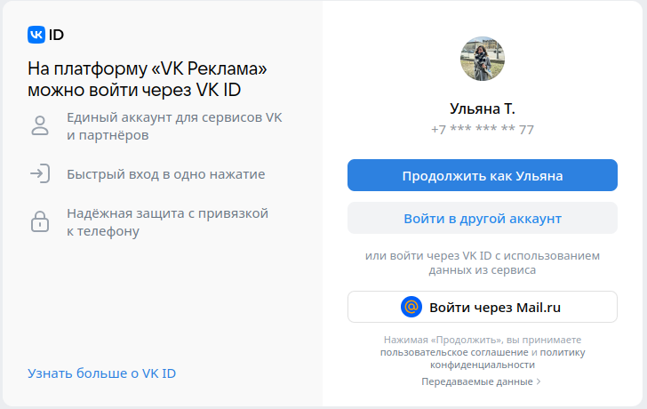
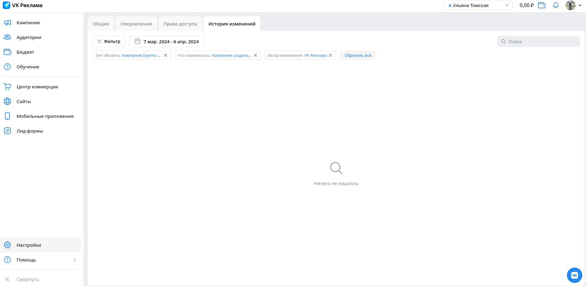

## Главная страница (для неавторизованных пользователей)

- Слайдер регистрации. При нажатии на кнопку "Зарегистрироваться" происходит переход на страницу регистрации

#### Кейсы компаний

- Кейсы компаний. При переходе по ссылке "Смотреть все" происходит переход на страницу кейсов (https://ads.vk.com/cases)
- Кейсы компаний. При нажатии на любой блок кейса происходит переход на страницу данного кейса

#### Обучающие вебинары

- Вебинары. При нажатии на кнопку "Подробнее" происходит переход на страницу мероприятий (https://ads.vk.com/events)
- Вебинары. При нажатии на баннер "Вебинары" происходит переход на страницу мероприятий (https://ads.vk.com/events)

#### Блок новостей

- Новости. При нажатии на блок новостей происходит переход на страницу данной новости 

## Кабинет (главная страница для авторизованных пользователей)

- Кабинет. После авторизации происходит переход на страницу кампаний 
- Кабинет. Меню. При нажатии на кнопку "Компании" происходит переход на страницу компаний
- Кабинет. Меню. При нажатии на кнопку "Аудитории" происходит переход на страницу аудиторий (https://ads.vk.com/hq/audience) 
- Кабинет. Меню. При нажатии на кнопку "Бюджет" происходит переход на страницу бюджета (https://ads.vk.com/hq/budget/transactions)
- Кабинет. Меню. При нажатии на кнопку "Обучение" открывается модальное окно обучения 
- Кабинет. Меню. При нажатии на кнопку "Обучение" и последующем нажатии на любое место экрана за пределами модального окна обучения окно обучения исчезает
- Кабинет. Меню. При нажатии на кнопку "Центр коммерции" происходит переход на страницу центра коммерции (https://ads.vk.com/hq/ecomm/catalogs)
- Кабинет. Меню. При нажатии на кнопку "Сайты" происходит переход на страницу сайтов (https://ads.vk.com/hq/pixels)
- Кабинет. Меню. При нажатии на кнопку "Мобильные приложения" происходит переход на страницу мобильных приложений (https://ads.vk.com/hq/apps)
- Кабинет. Меню. При нажатии на кнопку "Лид-формы" происходит переход на страницу лид-форм (https://ads.vk.com/hq/leadads/leadforms)
- Кабинет. Меню. При нажатии на кнопку "Настройки" происходит переход на страницу настроек (https://ads.vk.com/hq/settings)
- Кабинет. Меню. При нажатии на кнопку "Помощь" рядом открывается модальное окно с подсказками 
- Кабинет. Меню. При нажатии на кнопку "Помощь" и последующем нажатии на любое место экрана за пределами модального окна с подсказками данное окно исчезает
- Кабинет. Меню. При нажатии на кнопку "Помощь" и последующем нажатии на кнопку "Кейсы компаний" модального окна подсказок в новой вкладке открывается страница кейсов (https://ads.vk.com/cases)
- Кабинет. Меню. При нажатии на кнопку "Помощь" и последующем нажатии на кнопку "Справка" модального окна подсказок в новой вкладке открывается страница справки (https://ads.vk.com/help)
- Кабинет. Меню. При нажатии на кнопку "Помощь" и последующем нажатии на кнопку "Форум идей" модального окна подсказок в новой вкладке открывается страница форума идей (https://ads.vk.com/upvote)
- Кабинет. Меню. При нажатии на кнопку "Помощь" и последующем нажатии на кнопку "Задать вопрос" открывается виджет мессенджера VK

### Шапка кабинета

- Шапка кабинета. При нажатии на логотип VK Рекламы происходит переход на страницу кампаний
- Шапка кабинета. При нажатии на поле с именем открывается модальное окно со списком кабинетов и ID
- Шапка кабинета. При нажатии на поле с именем и последующем нажатии на кнопку меню "Все кабинеты" происходит переход в раздел прав доступа настроек (https://ads.vk.com/hq/settings/access)
- Шапка кабинета. При нажатии на иконку с кошельком и суммой открывается модальное окно для пополнения счёта
- Шапка кабинета. При нажатии на знак уведомления открывается модальное окно уведомлений
- Шапка кабинета. При нажатии на фото профиля открывается модальное окно управления VK ID
- Шапка кабинета. При нажатии на фото профиля и последующем нажатии на раздел модального окна управления VK ID в новой вкладке открывается страница VK ID (https://id.vk.com/account/#/main)
- Шапка кабинета. При нажатии на фото профиля и последующем нажатии на раздел модального окна "Выйти" происходит переход на главную страницу для неавторизованного пользователя (https://ads.vk.com/)

## Авторизация и регистрация 

### Страница аутентификации

- При нажатии на кнопку "Войти в другой аккаунт" появляется форма для входа в другой аккаунт VK
- При нажатии на кнопку "Войти через Mail.ru" открывается форма для входа в почту Mail.ru

### Регистрация

- При нажатии на кнопку "Создать новый кабинет" происходит переход на страницу создания кабинета (https://ads.vk.com/hq/registration/new)
- Создание кабинета. При выборе типа аккаунта "Рекламодатель" автоматически снимается флаг с типа "Агентство"
- Создание кабинета. При выборе страны "Россия" автоматически валютой выбирается "Российский рубль (RUB)"
- Создание кабинета. При незаполнении поля email и нажатии кнопки "Создать кабинет" под полем email появляется сообщение "Обязательное поле"
- Создание кабинета. При вводе некорректного email под полем email появляется ошибка "Некорректный email адрес"
- Создание кабинета. При выборе типа аккаунта "Физическое лицо" и вводе меньше 12 цифр в поле ИНН под полем ИНН появляется ошибка "Минимальная длина 12 символов"
- Создание кабинета. При выборе типа аккаунта "Физическое лицо" и вводе больше 12 цифр в поле ИНН под полем ИНН появляется ошибка "Максимальная длина 12 символов"
- Создание кабинета. При нажатии кнопки "Создать кабинет" с неотмеченной галочкой и принятии условий рядом с данным полем появляется сообщение "Обязательное поле"
- Создание кабинета. При корpектном заполнении всех обязательных полей и нажатии кнопки "Создать кабинет" происходит переход на страницу кампаний

## Новости (https://ads.vk.com/news)

- Новости. При нажатии на кнопку "Подробнее" у конкретной новости происходит переход на страницу данной новости
- Новости. При нажатии на блок новости происходит переход на страницу данной новости

### Страница новости

- Страница новостей. При нажатии на кнопку "Запустить рекламу" или "В кабинет" в новой вкладке открывается страница кабинета для авторизованных пользователей (и на страницу авторизации для неавторизованных)
- Страница новостей. При нажатии на стрелку "Новости" происходит возврат на страницу новостей

## Форум идей (https://ads.vk.com/upvote)

- Форум идей. При вводе в поле поиска текстового запроса (например "реклама") и нажатия Enter выдается список идей, где в названии есть данное слово 
- Форум идей. При вводе в поле поиска числового запроса id (например 3) и нажатия Enter выдается идея с заданным id
- Форум идей. При нажатии на поле выбора темы открывается выпадающий список тем
- Форум идей. При нажатии на поле выбора темы и последующем нажатии на одну из тем выпадающего списка выбирается данная тема и выдается список идей с данной темой
- Форум идей. При нажатии на поле выбора статуса открывается выпадающий список статусов
- Форум идей. При нажатии на поле выбора статуса и последующем нажатии на один из статусов выпадающего списка выбирается данный статус и выдается список идей с данным статусом
- Форум идей. При нажатии на название идеи происходит переход на страницу идеи
- Форум идей. При нажатии на кнопку "Предложить идею" открывается модальное окно с условиями для участия в форуме

### Страница идеи

- Страница идеи. При нажатии на знак ссылки появляется поп-ап "Ссылка скопирована"
- Страница идеи. При нажатии на кнопку комментария открывается список комментариев (количество комментариев в списке соответствует числу на кнопке)

## Настройки. Общее

- Изменение данных. При начале ввода данных в любое поле внизу страницы появляются кнопки "Сохранить" и "Отменить" 
- Изменение данных. При нажатии кнопки "Сохранить" и незаполненных обязательных полях под данными полями появляется соответствующее сообщение
- Изменение данных. При вводе некорректного номера телефона под полем телефона появляется ошибка "Некорректный номер телефона"
- Изменение данных. При нажатии на кнопку "Добавить email" появляется новое поле для добавления email
- Изменение данных. При нажатии на кнопку "Добавить email" и вводе некорректного email под полем email появляется ошибка "Некорректный email"
- Изменение данных. При нажатии на кнопку "Добавить email" и вводе корректного email
- Изменение данных. При вводе некорректного ИНН под полем ИНН появляется ошибка "Некорректный ИНН"
- Изменение данных. При вводе меньше 12 цифр в поле ИНН под полем ИНН появляется ошибка "Длина ИНН должна быть 12 символов"
- Изменение данных. При нажатии на поле язык интерфейса и выборе соответсвующего языка в выпадающем списке происходит выбор данного языка
- Изменение данных. При корректном заполнении всех полей и нажатии кнопки "Сохранить" данные сохраняются
- Изменение данных. При заполнении каких-либо полей и нажатии кнопки отменить данные не сохраняются
- Настройки. Общее. В разделе доступа к API при нажатии на ссылку "Подробнее о доступе" в новой вкладке открывается страница API VK Рекламы (https://ads.vk.com/help/articles/help_api)
- Настройки. Общее. При нажатии кнопки "Удалить кабинет" появляется модальное окно удаления кабинета
- Настройки. Общее. При нажатии кнопки раздела "Уведомления" происходит переход на страницу настроек уведомлений (https://ads.vk.com/hq/settings/notifications)
- Настройки. Общее. При нажатии кнопки раздела "Права доступа" происходит переход на страницу настроек прав доступа (https://ads.vk.com/hq/settings/access)
- Настройки. Общее. При нажатии кнопки раздела "История изменений" происходит переход на страницу истории изменений (https://ads.vk.com/hq/settings/logs)

## Настройки. История изменений

- Настройки. История изменений. При нажатии на кнопку "Фильтр" открывается модальное окно фильтров
- Настройки. История изменений. При выборе раздела "Тип объекта" открываются различные типы объектов
- Настройки. История изменений. При выборе раздела "Что изменилось" открываются различные типы изменений
- Настройки. История изменений. При выборе раздела "Автор изменений" открываются различные авторы изменений
- Настройки. История изменений. При поисковом запросе во всех трех категориях происводится поиск по заданному фрагменту
- Настройки. История изменений. При проставлении галочек в пуктах фильтра нажатии кнопки "Применить" на странице отображается информация и выбранных фильтрах
- Настройки. История изменений. При нажатии на кнопку с диапазоном дат открывается модальное окно с выбором даты

