## Главная страница (для неавторизованных пользователей)

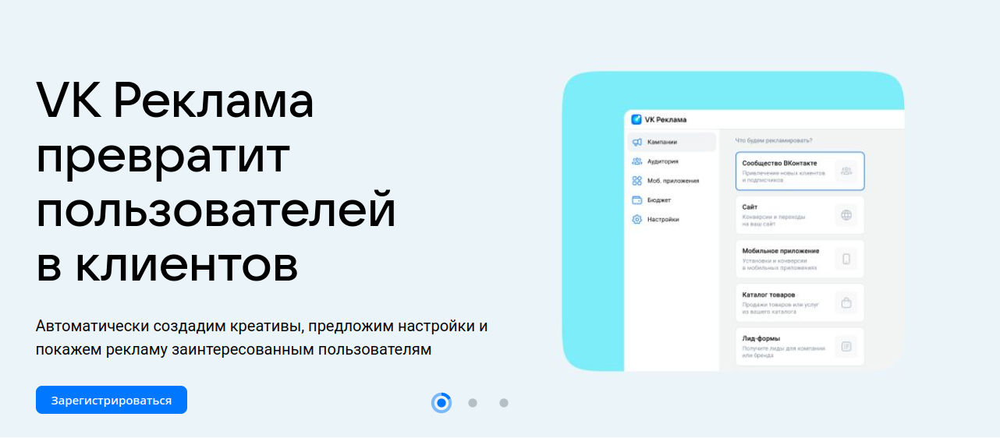

- Слайдер регистрации. При нажатии на кнопку "Зарегистрироваться" происходит переход на страницу регистрации

#### Кейсы компаний

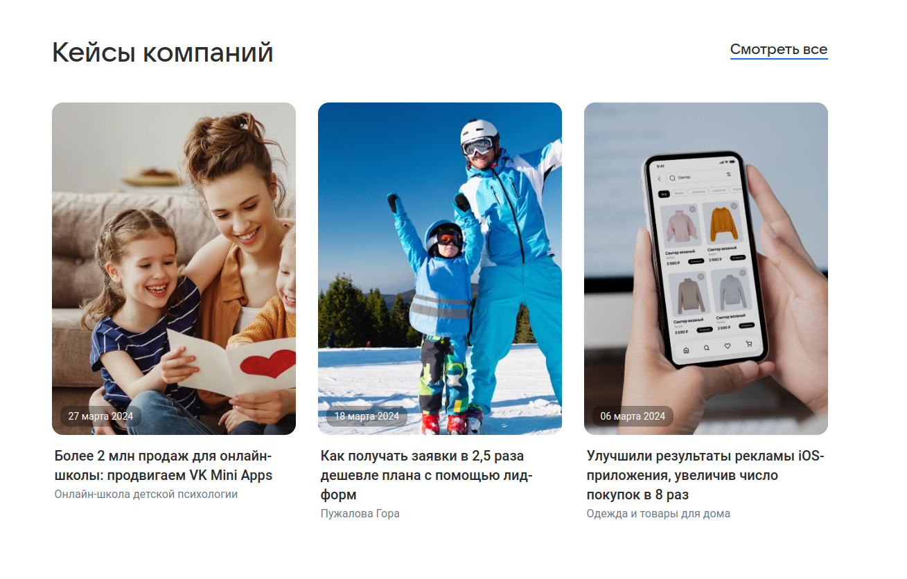

- Кейсы компаний. При переходе по ссылке "Смотреть все" происходит переход на страницу кейсов (https://ads.vk.com/cases)
- Кейсы компаний. При нажатии на любой блок кейса происходит переход на страницу данного кейса

#### Обучающие вебинары

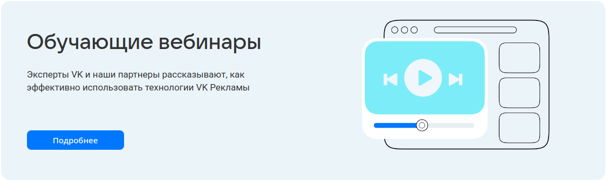

- Вебинары. При нажатии на баннер "Вебинары" происходит переход на страницу мероприятий (https://ads.vk.com/events)

#### Блок новостей

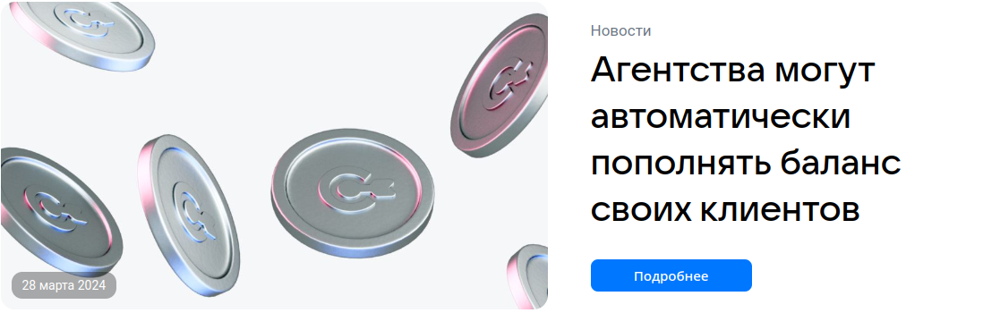

- Новости. При нажатии на блок новостей происходит переход на страницу данной новости 

## Кабинет (главная страница для авторизованных пользователей)

- После авторизации происходит переход на страницу обзора 

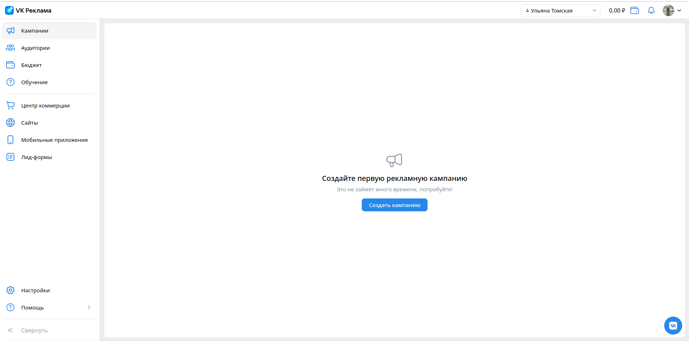

### Меню

- По кнопке "Кампании" происходит переход на страницу кампаний
- По кнопке "Аудитории" происходит переход на страницу аудиторий (https://ads.vk.com/hq/audience) 
- По кнопке "Бюджет" происходит переход на страницу бюджета (https://ads.vk.com/hq/budget/transactions)
- По кнопке "Обучение" открывается модальное окно обучения 
- По кнопке "Обучение" и последующем нажатии на любое место экрана за пределами модального окна обучения окно обучения исчезает
- По кнопке "Центр коммерции" происходит переход на страницу центра коммерции (https://ads.vk.com/hq/ecomm/catalogs)
- По кнопке "Сайты" происходит переход на страницу сайтов (https://ads.vk.com/hq/pixels)
- По кнопке "Мобильные приложения" происходит переход на страницу мобильных приложений (https://ads.vk.com/hq/apps)
- По кнопке "Лид-формы" происходит переход на страницу лид-форм (https://ads.vk.com/hq/leadads/leadforms)
- По кнопке "Настройки" происходит переход на страницу настроек (https://ads.vk.com/hq/settings)
- По кнопке "Помощь" рядом открывается модальное окно с подсказками 
- По кнопке "Помощь" и последующем нажатии на любое место экрана за пределами модального окна с подсказками данное окно исчезает
- По кнопке "Помощь" -> "Кейсы компаний" в новой вкладке открывается страница кейсов (https://ads.vk.com/cases)
- По кнопке "Помощь" -> "Справка" в новой вкладке открывается страница справки (https://ads.vk.com/help)
- По кнопке "Помощь" -> "Форум идей" в новой вкладке открывается страница форума идей (https://ads.vk.com/upvote)

### Шапка кабинета

- При нажатии на логотип VK Рекламы происходит переход на страницу обзора
- При нажатии на поле с именем открывается модальное окно со списком кабинетов и ID
- При нажатии на поле с именем и последующем нажатии на кнопку меню "Все кабинеты" происходит переход в раздел прав доступа настроек (https://ads.vk.com/hq/settings/access)
- При нажатии на иконку с кошельком и суммой открывается модальное окно для пополнения счёта
- При нажатии на знак уведомления открывается модальное окно уведомлений
- При нажатии на фото профиля открывается модальное окно управления VK ID
- При нажатии на фото профиля и последующем нажатии на раздел модального окна "Выйти" происходит переход на главную страницу для неавторизованного пользователя (https://ads.vk.com/)

## Регистрация 

### Регистрация

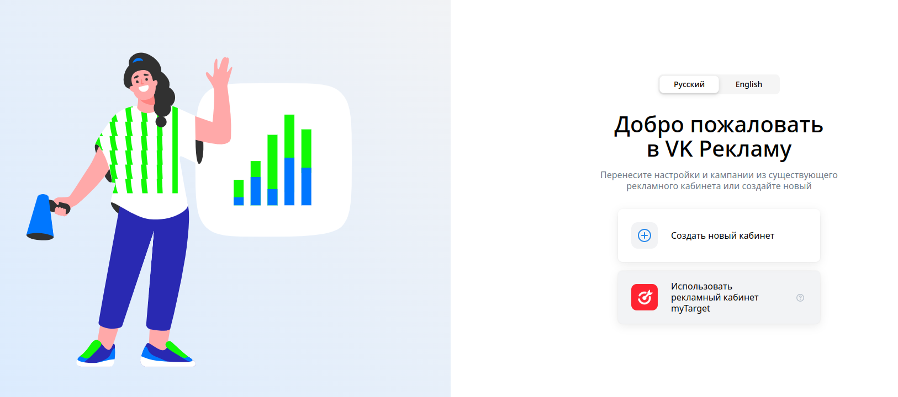

- При нажатии на кнопку "Создать новый кабинет" происходит переход на страницу создания кабинета (https://ads.vk.com/hq/registration/new)

### Создание кабинета

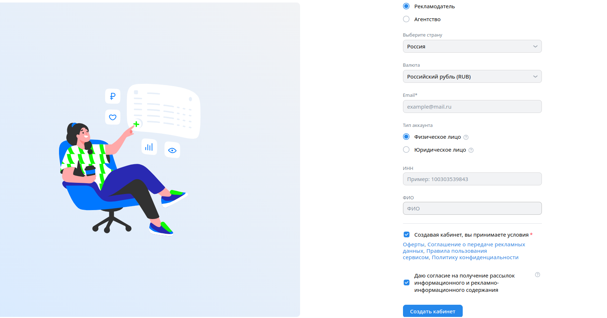

- При выборе страны "Россия" автоматически валютой выбирается "Российский рубль (RUB)"
- При незаполнении поля email и нажатии кнопки "Создать кабинет" под полем email появляется сообщение "Обязательное поле"
- При вводе некорректного email (почты без символа "@" или без точки в домене или содержащей кириллицу) под полем email появляется соответствующая ошибка 
- При выборе типа аккаунта "Физическое лицо" и вводе меньше 12 цифр в поле ИНН под полем ИНН появляется соответствующая ошибка
- При выборе типа аккаунта "Физическое лицо" и вводе больше 12 цифр в поле ИНН под полем ИНН появляется соответствующая  ошибка
- При нажатии кнопки "Создать кабинет" с неотмеченной галочкой и принятии условий рядом с данным полем появляется сообщение "Обязательное поле"
- При корpектном заполнении всех обязательных полей и нажатии кнопки "Создать кабинет" происходит переход на страницу кампаний

## Новости (https://ads.vk.com/news)

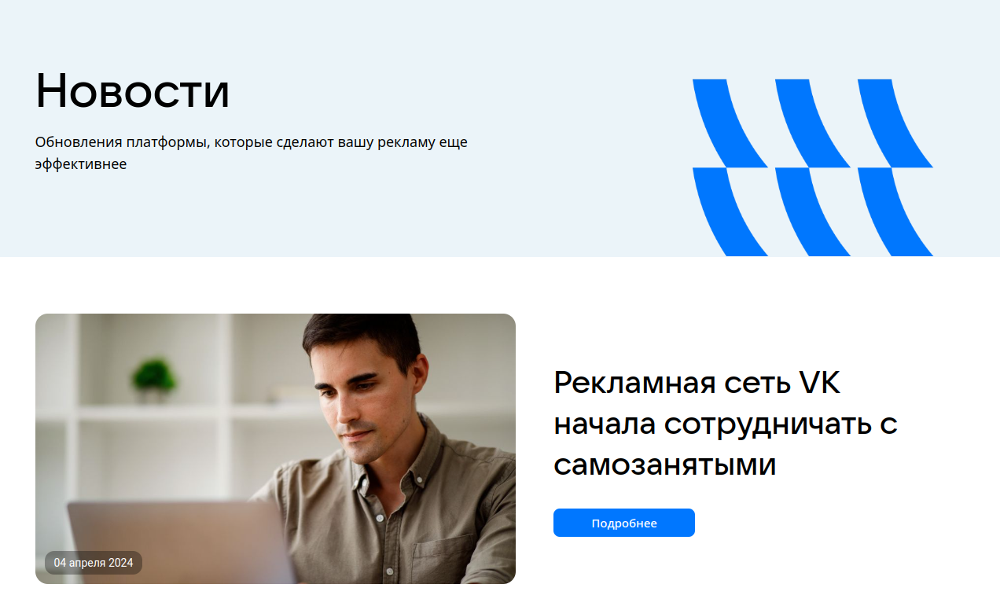

- При нажатии на кнопку "Подробнее" у конкретной новости происходит переход на страницу данной новости
- При нажатии на блок новости происходит переход на страницу данной новости

### Страница новости

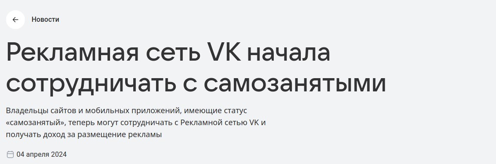

- При нажатии на кнопку "Запустить рекламу" или "В кабинет" в новой вкладке открывается страница кабинета для авторизованных пользователей (и страница авторизации для неавторизованных)
- При нажатии на стрелку "Новости" происходит возврат на страницу новостей

## Форум идей (https://ads.vk.com/upvote)

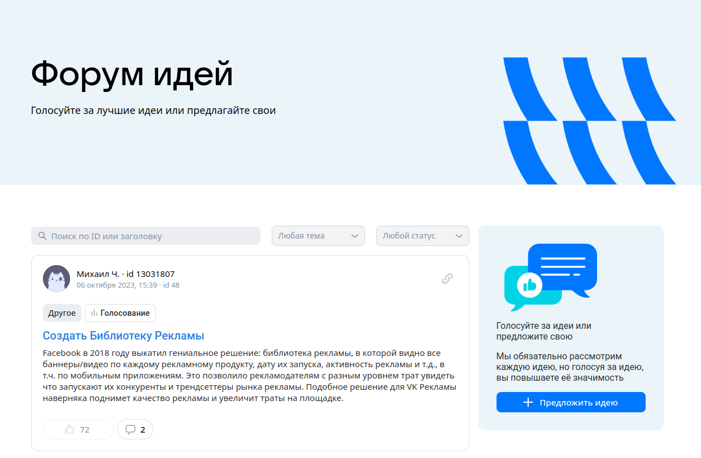

- При вводе в поле поиска текстового запроса (например "реклама") и нажатия Enter выдается список идей, где в названии есть данное слово 
- При вводе в поле поиска числового запроса id (например 3) и нажатия Enter выдается идея с заданным id
- При нажатии на поле выбора темы открывается выпадающий список тем
- При нажатии на поле выбора темы и последующем нажатии на одну из тем выпадающего списка выбирается данная тема и выдается список идей с данной темой
- При нажатии на поле выбора статуса открывается выпадающий список статусов
- При нажатии на поле выбора статуса и последующем нажатии на один из статусов выпадающего списка выбирается данный статус и выдается список идей с данным статусом
- При нажатии на название идеи происходит переход на страницу идеи
- При нажатии на кнопку "Предложить идею" открывается модальное окно с условиями для участия в форуме

### Страница идеи

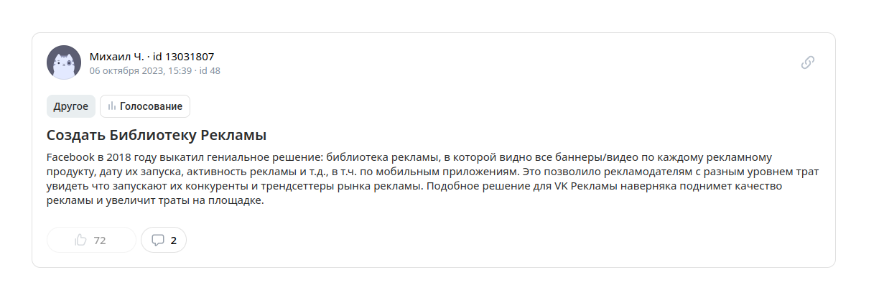

- При нажатии на знак ссылки появляется поп-ап "Ссылка скопирована"
- При нажатии на кнопку комментария открывается список комментариев 
- Количество комментариев в списке соответствует числу на кнопке

## Настройки. Общее

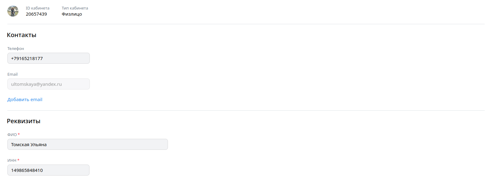
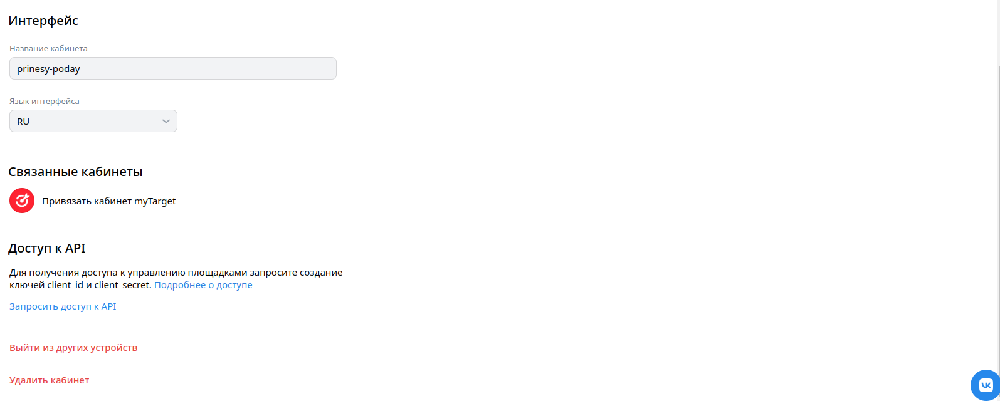

### Изменение данных

- При начале ввода данных в любое поле внизу страницы появляются кнопки "Сохранить" и "Отменить" 
- При нажатии кнопки "Сохранить" и незаполненных обязательных полях под данными полями появляется соответствующее сообщение
- При вводе некорректного номера телефона под полем телефона появляется соответствующая ошибка
- При нажатии на кнопку "Добавить email" появляется новое поле для добавления email
- При нажатии на кнопку "Добавить email" и вводе некорректного email под полем email появляется соответствующая ошибка
- При нажатии на кнопку "Добавить email" и вводе корректного email
- При вводе некорректного ИНН под полем ИНН появляется ошибка "Некорректный ИНН"
- При вводе меньше 12 цифр в поле ИНН под полем ИНН появляется соответствующая ошибка
- При нажатии на поле язык интерфейса и выборе соответсвующего языка в выпадающем списке происходит выбор данного языка
- При корректном заполнении всех полей и нажатии кнопки "Сохранить" данные сохраняются
